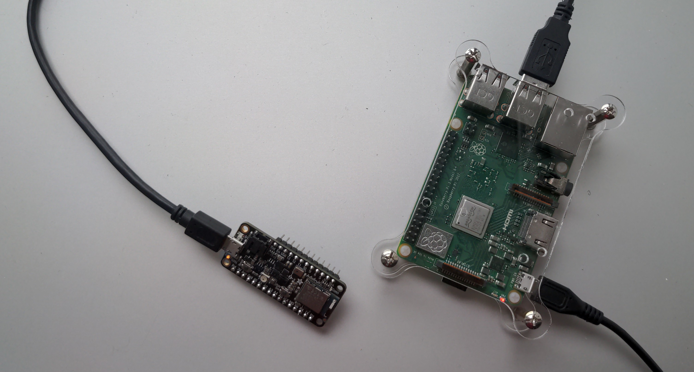
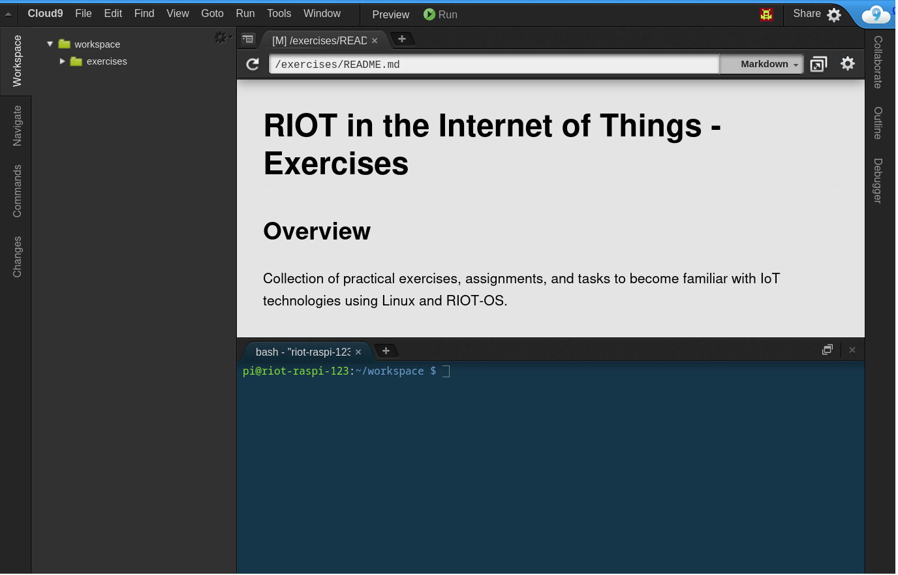

# Getting Started

Welcome to RIOT, the friendly Operating System for the Internet of Things!

RIOT is a free, open source, real-time capable operating system developed by a grassroots community
gathering companies, academia, and hobbyists, distributed all around the world.
It supports most low-power IoT devices, microcontroller architectures (32-bit, 16-bit, 8-bit), and external devices.
RIOT aims to implement all relevant open standards supporting an Internet of Things that is connected, secure, durable & privacy-friendly.

Pretty cool, right?

But before getting started with coding and real hardware,
let's understand what is inside the IoT Kit in front of you.

## IoT Kit Content

When opening the IoT Kit, you will find the following content:

1. [**Raspberry Pi**](https://www.raspberrypi.com/documentation/computers/getting-started.html)
  already completely setup to be used as development machine throughout these exercises.
2. **Power Adapter for the Raspberry Pi**
3. [**Adafruit Feather Sense**](https://learn.adafruit.com/adafruit-feather-sense) (RFM98 @ 433 MHz):
  an IoT device featuring wireless connectivity and many on-board sensors
4. **USB Cable** to connect the Feather Sense to the development machine
5. [**Adafruit LoRa Radio FeatherWing**](https://learn.adafruit.com/radio-featherwing):
  an extension board for kilometer-range wireless connectivity using LoRa
6. **Jumper Cables** (12x) to connect external devices such as LEDs or buttons to the Feather Sense
7. **Breadboard** to build semi-permanent prototypes of electronic circuits

## Hardware Setup

- Power the Raspberry Pi (1) using the power adapter (2).
- Connect the Feather Sense (3) to the Raspberry Pi (1) using the USB cable (4).

## Software Setup

- Connect to the locally provided WiFi network:
  - SSID: `hack_n_ack`
  - Password: `ThefriendlyOSfortheIoT`
- Access a cloud9 IDE on your Raspberry Pi from your browser
  - URL: `https://riot-raspi-x.local:8080` (x ∈ {1..N})
  - User: `pi`
  - Password: `riottutorial`

The tutorial files should already be preloaded.
Cloud9 IDE lets you browse through the files using the directory tree on the left,
write code and preview Markdown (such as this document) on the right,
and access the console of the Raspberry Pi on the lower right.

## Working with the IoT Kit at home

If you want to work with the IoT Kit at home,
the easiest option is to connect the Raspberry Pi via Ethernet to your home router.
Alternatively, you may add the credentials of your home WiFi to the Raspberry Pi
as explained here: https://weworkweplay.com/play/automatically-connect-a-raspberry-pi-to-a-wifi-network/

If you prefer to develop without the Raspberry Pi on your own Linux machine,
you can find the [general instructions to set up you RIOT development environment](https://doc.riot-os.org/getting-started.html)
and the [specific ones for the Feather Sense](https://doc.riot-os.org/group__boards__feather-nrf52840-sense.html)
in the RIOT documentation.
