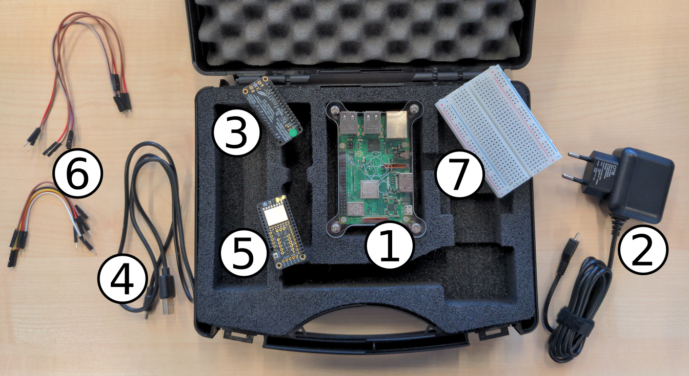
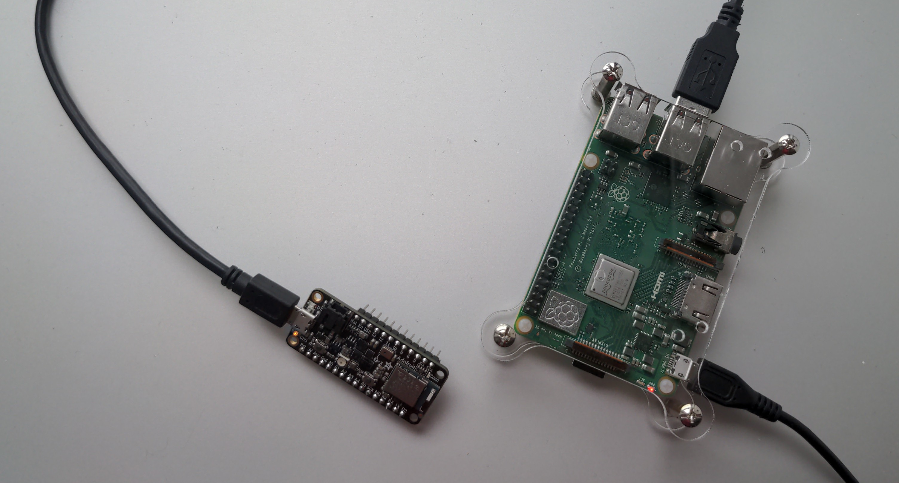

# Erste Schritte

Willkommen bei RIOT, dem freundlichen Betriebssystem für das Internet der Dinge!

RIOT ist ein freies, offenes Betriebssystem.
Aber was ist ein **Betriebssystem** eigentlich?
EinBetriebssystem ist die grundlegende Software, die dafür sorgt, dass ein Gerät funktioniert.
Es steuert die Hardware (z. B. Prozessor, Speicher oder Sensoren) und ermöglicht es, Programme auszuführen.
Du kennst vielleicht schon Betriebssysteme wie **Windows**, **macOS** oder **Android**, die auf deinem Computer oder Smartphone laufen.

Im Gegensatz dazu läuft RIOT auf sehr viel kleineren, stromsparenden Geräten.
Sie werden zum Beispiel im Smart-Home eingesetzt, damit du deine Heizung mit dem Smartphone über das Internet steuern kannst.
Diese Geräte enthalten oft einen **Mikrocontroller**.

> **Was ist ein Mikrocontroller?**
>
> Ein Mikrocontroller ist ein winziger Computer auf einem Chip.
> Er kann einfache Aufgaben übernehmen, wie z. B. Sensoren auslesen oder LEDs ein- und ausschalten.

Das Ziel von RIOT ist es, ein **Internet der Dinge** zu schaffen, das vernetzt, sicher, langlebig und datenschutzfreundlich ist.

Ziemlich cool, oder?

Bevor wir jedoch mit dem Programmieren und der echten Hardware beginnen, schauen wir uns an, was sich im RIOT Kit vor dir befindet.

## RIOT Kit Inhalt

Wenn du das RIOT Kit öffnest, findest du folgende Teile:

1. [**Raspberry Pi**](https://www.raspberrypi.com/documentation/computers/getting-started.html):
   Ein kleiner Computer, der bereits vollständig eingerichtet ist. Er dient als Programmierumgebung für unsere Übungen.
2. **Stromanschluss für den Raspberry Pi**
   Damit versorgst du den Raspberry Pi mit Strom.
3. [**Adafruit Feather Sense**](https://learn.adafruit.com/adafruit-feather-sense):
   Ein Mikrocontroller mit kabelloser Kommunikation und vielen eingebauten Sensoren.
   Auf diesem Board werden wir RIOT installieren und ausführen!
4. **USB-Kabel**, um den Feather Sense mit dem Raspberry Pi zu verbinden.

## Hardware Setup

- Versorge den Raspberry Pi (1) mit Strom über den Power Adapter (2).
- Verbinde den Feather Sense (3) mit dem Raspberry Pi (1) über das USB-Kabel (4).

