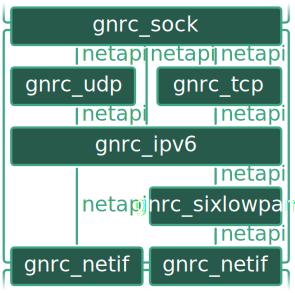

# GNRC and NETAPI

RIOT provides a modular network stack, GNRC, which allows an isolated implementation of protocols on
any layer of the OSI model. The protocol implementations communicate via an API called *NETAPI*.



*NETAPI* consists of 5 IPC API operations, 2 packet operations and 3 option operations. It utilizes
the [msg API](https://doc.riot-os.org/group__core__msg.html) of the RIOT core:

- `GNRC_NETAPI_MSG_TYPE_RCV`: Asynchronously pass packets up the network stack
  (receive from upper protocol).
- `GNRC_NETAPI_MSG_TYPE_SND`: Asynchronously pass packets down the network stack
  (send from lower protocol).
- `GNRC_NETAPI_MSG_TYPE_SET`: Synchronously set an option for a protocol.
- `GNRC_NETAPI_MSG_TYPE_GET`: Synchronously get an option for a protocol.
- `GNRC_NETAPI_MSG_TYPE_ACK`: Reply `SET` and `GET`. Returns success and error codes as well
  as the actual value for `GET`.


Other protocols can register to packet operations using the
[network protocol registry `gnrc_netreg`](https://doc.riot-os.org/group__net__gnrc__netreg.html).

To use GNRC we need to include at least one GNRC submodule, IPv6 in our case:

```Makefile
USEMODULE += gnrc_ipv6_default
```

The core GNRC API, including NETAPI, `gnrc_netreg`, and also the interface API `gnrc_netif` is
exposed via the `net/gnrc.h` header file:

```C
#include "net/gnrc.h"
```

## Getting the IPv6 addresses of a network interface

Flash the application to your node and open a terminal.

```sh
$ make flash term
```

It will show the IPv6 address for the network interface—you might need to reset your node.
Alternatively, you can use the `ifconfig` shell command.

```sh
> ifconfig
```

`main.c` shows how to `GET` the IPv6 addresses of all interfaces of a node.

`gnrc_netif_iter()` is used to iterate over all interfaces:

```C
gnrc_netif_t *netif = NULL;
while ((netif = gnrc_netif_iter(netif))) {
    /* operations on `netif` */
}
```

The `gnrc_netapi_get()` helper function is used to call the `GNRC_NETAPI_MSG_TYPE_GET` IPC operation
for getting the IPv6 addresses of `netif`, identified by its PID.

```C
ipv6_addr_t ipv6_addrs[CONFIG_GNRC_NETIF_IPV6_ADDRS_NUMOF];
int res = gnrc_netapi_get(netif->pid, NETOPT_IPV6_ADDR, 0, ipv6_addrs,
                          sizeof(ipv6_addrs));

if (res < 0) {
    puts(" {}");
    continue;
}
for (unsigned i = 0; i < (unsigned)(res / sizeof(ipv6_addr_t)); i++) {
    /* output the address */
}
```

Note, that in an error case we just skip the interface all together and that the return value of
`gnrc_netapi_get()` contains the result in bytes, not in number of addresses, due to the generic
nature of `GET`.

You can try to ping another group using the shell command `ping`:

```sh
> ping fe80::204:2519:1801:ae82
```

## Task 1

Register the application to receive IPv6 messages and handle them.

To be able to receive packets asynchronously in the first place, the thread needs a message
queue:

```C
msg_t msg_queue[MSG_QUEUE_SIZE];
msg_init_queue(msg_queue, MSG_QUEUE_SIZE);
```

This is already prepared in `main.c` for `ping` to work. `MSG_QUEUE_SIZE` must be a power of 2.

You can register for packets of a certain type (protocol) and context (the experimental protocol
number 253 in our case) using `gnrc_netreg_register()` from `net/gnrc/netreg.h` (which is provided
via `net/gnrc.h`):

```C
gnrc_netreg_entry_t server = GNRC_NETREG_ENTRY_INIT_PID(253, thread_getpid());
gnrc_netreg_register(GNRC_NETTYPE_IPV6, &server);
```

You can receive packets using the `msg_receive()` function from `msg.h`. The type of the message
(`msg.type`) contains the NETAPI operation type, `msg.content.ptr` a pointer to the packet.

In GNRC, packets are represented as parsed list and are in reverse order on
receive: The payload will be the first with the next lower layer header
following that and the lowest layer header being last.

Remember to release packets after you used them using `gnrc_pktbuf_release()`.
Otherwise, you will create memory leaks.

`net/gnrc/netif/hdr.h` and `net/ipv6/hdr.h` contain helper functions to print the respective headers
and the payload can be dumped using `od_hex_dump()` from `od.h` or as string using `printf()` with
the `%.*s` format string.

```C
while (1) {
    msg_t msg;

    msg_receive(&msg);
    if (msg.type == GNRC_NETAPI_MSG_TYPE_RCV) {
        gnrc_pktsnip_t *pkt = msg.content.ptr;

        if (pkt->next) {
            if (pkt->next->next) {
                puts("=== Link layer header ===");
                gnrc_netif_hdr_print(pkt->next->next->data);
            }
            /* print IPv6 header */
            puts("=== IPv6 header ===");
            ipv6_hdr_print(pkt->next->data);
        }

        /* print IPv6 payload */
        puts("=== IPv6 payload (hex) ===");
        od_hex_dump(pkt->data, pkt->size, OD_WIDTH_DEFAULT);
        printf("=== IPv6 payload (string) === \"%.*s\"\n", pkt->size, (char *)pkt->data);

        gnrc_pktbuf_release(pkt);
    }
}
```

Though the code will not be reachable, you can unregister from a registration using
`gnrc_netreg_unregister()` after the loop:

```C
gnrc_netreg_unregister(GNRC_NETTYPE_IPV6, &server);
```

Now you can receive IPv6 packets for the experimental transport protocol 253, but to test this?
Let us exchange data with other groups by sending packets!

## Task 2

Sending IPv6 packets.

First, we need to move the reception to its own thread, so we can still use the shell in the main
thread. Revisit the [Threads excercise](../06-threads) for that. Remember that the message queue
from Task 1 needs to be initialized for the new thread!

Now we implement sending as a shell command that expects two arguments: the destination address and
a string message. You can also revisit the [Shell excercise](../03-shell) for more on shell
.

```C
int send_packet(int argc, char **argv)
{
    if (argc != 3) {
        puts("usage: send <IPv6 address> <message>");
        puts("Note: to send multiple words wrap the message in \"\"");
        return 1;
    }

    /* Shell command */
}

SHELL_COMMAND(send, "Send a message over IPv6", send_packet);
```

You can parse the IPv6 address (including the network interface ID in `%<id>` notation) using
the `netutils_get_ipv6()` function from the `net/utils.h` header:

```C
netif_t *netif;
ipv6_addr_t addr;
if (netutils_get_ipv6(&addr, &netif, argv[1]) < 0) {
    puts("Unable to parse IPv6 address\n");
    return 1;
}
```

The packet is constructed as a linked list of PKTSNIPs using `gnrc_pktsnip_add()`. In GNRC they are
in the correct order (from lowest header to payload) for sending.

`net/gnrc/netif/hdr.h` and `net/ipv6/hdr.h` also contain helper functions for building the
respective headers. However, the arguments for those functions are limited, so they might need
extra handling for special fields, such as the protocol number in the IP header and GNRC-specific
network interface values in the link layer.

```C
gnrc_pktsnip_t *payload, *ip;
ipv6_hdr_t *ip_hdr;
size_t payload_size = strlen(argv[2]);

/* start packet with payload */
payload = gnrc_pktbuf_add(NULL, argv[2], payload_size, GNRC_NETTYPE_UNDEF);
if (payload == NULL) {
    puts("Unable to copy message to packet buffer");
    return 1;
}
/* add IPv6 header with payload as next header */
ip = gnrc_ipv6_hdr_build(payload, NULL, &addr);
if (ip == NULL) {
    puts("Unable to allocate IPv6 header");
    gnrc_pktbuf_release(payload);
    return 1;
}
/* set IPv6 next header to experimental protocol number 253 */
ip_hdr = ip->data;
ip_hdr->nh = 253;
if (netif != NULL) {
    /* add link layer if netif is provided in argv[1] */
    gnrc_pktsnip_t *netif_hdr = gnrc_netif_hdr_build(NULL, 0, NULL, 0);
    if (netif_hdr == NULL) {
        puts("Unable to allocate netif header");
        gnrc_pktbuf_release(ip);
        return 1;
    }
    /* set GNRC specific network interface values */
    gnrc_netif_hdr_set_netif(netif_hdr->data,
                             container_of(netif, gnrc_netif_t, netif));
    /* prepend link layer header to IP packet */
    ip = gnrc_pkt_prepend(ip, netif_hdr);
}
```

The constructed packet can send be send to the IPv6-handling module (`gnrc_ipv6`) using the
`gnrc_netapi_dispatch_send()` helper function. This function looks up all registered protocol
handlers and uses `GNRC_NETAPI_MSG_TYPE_SND` to dispatch the packet to these.

```C
if (!gnrc_netapi_dispatch_send(GNRC_NETTYPE_IPV6,
                               GNRC_NETREG_DEMUX_CTX_ALL, ip)) {
    printf("Unable to locate IP thread");
    gnrc_pktbuf_release(ip);
    return 1;
}
```
